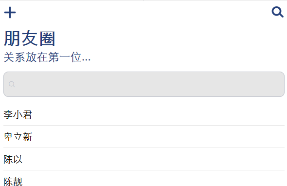

# stock-front

## Preview





## Keywords  
Vue、Vue Router、Axios、Element-ui.  
PHP、Mysql.

## Description
### Front End

使用Vue搭建前端，使用Element-ui组件，Vue Router控制页面路由，Axios发送异步请求。

### Back End  

PHP处理请求，进行权限校验。  

## Front End Build Setup
``` bash
# install dependencies
npm install

# serve with hot reload at localhost:8080
npm run dev

# build for production with minification
npm run build

# build for production and view the bundle analyzer report
npm run build --report
```

## Knowledgement

### 1、防止CSRF  
* 默认情况下，跨域请求不提供凭据(cookie、HTTP认证等)，通过将withCredentials属性设置为true，可以指定某个请求应该发送凭据。服务器接收到带凭据的请求，会响应对应的HTTP头部：`Access-Control-Allow-Credentials: true`。
* 同时，服务器端也要设置`Access-Control-Allow-Credentials: true`的HTTP头部，客户端每次发送数据请求时，服务器都对csrf_token进行校验，与session进行比较。

### 2、
``` html
<meta content="width=device-width, initial-scale=1.0, maximum-scale=1.0, minimum-scale=1.0, user-scalable=0" name="viewport">
```