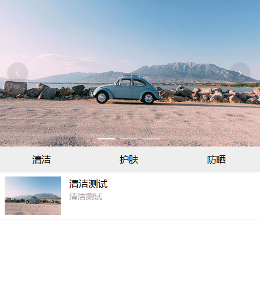
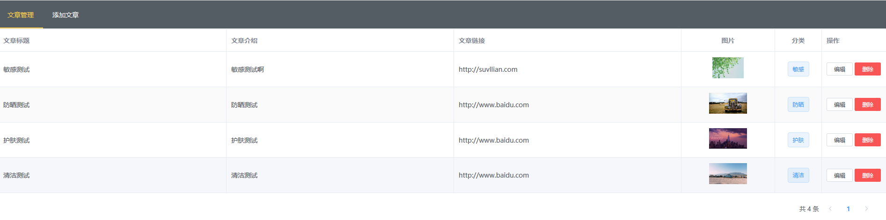

# stock-front

## Preview
Link：<a href="http://suvllian.com/douhu/#/" target="_blank">douhu</a>






## Keyword  
Vue、Vue Router、Axios、Element-ui.  
Express、Mysql.

## Description
### Front End

使用Vue搭建前端，使用Element-ui组件，Vue Router控制页面路由，Axios发送异步请求。

### Back End  

Express操作数据库，处理文件上传。  

## Front End Build Setup
``` bash
# install dependencies
npm install

# serve with hot reload at localhost:8080
npm run dev

# build for production with minification
npm run build

# build for production and view the bundle analyzer report
npm run build --report
```

## Back End Build Setup
``` bash
# install dependencies
npm install

# serve with hot reload at localhost:9000
npm run start
```
